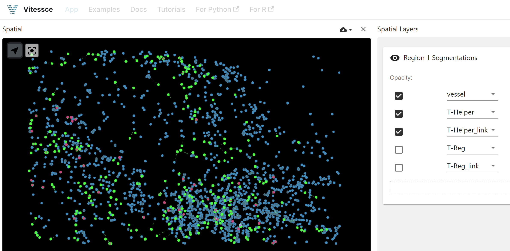
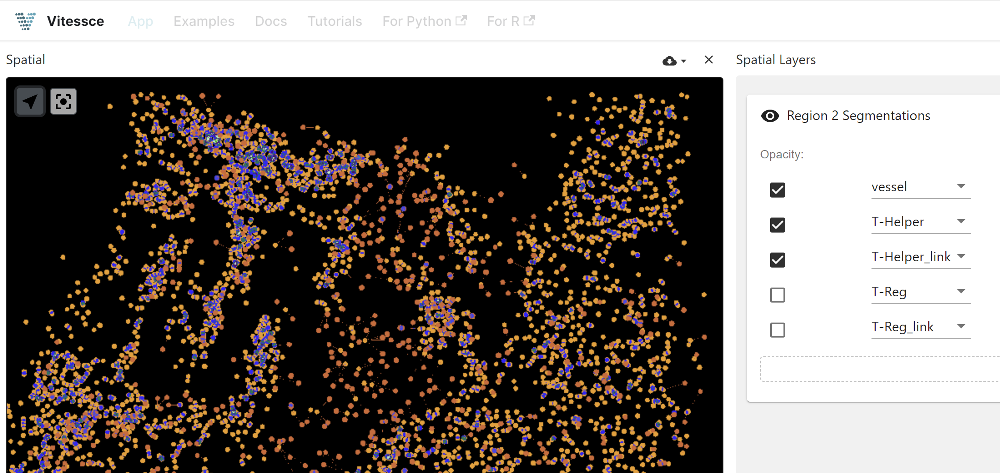
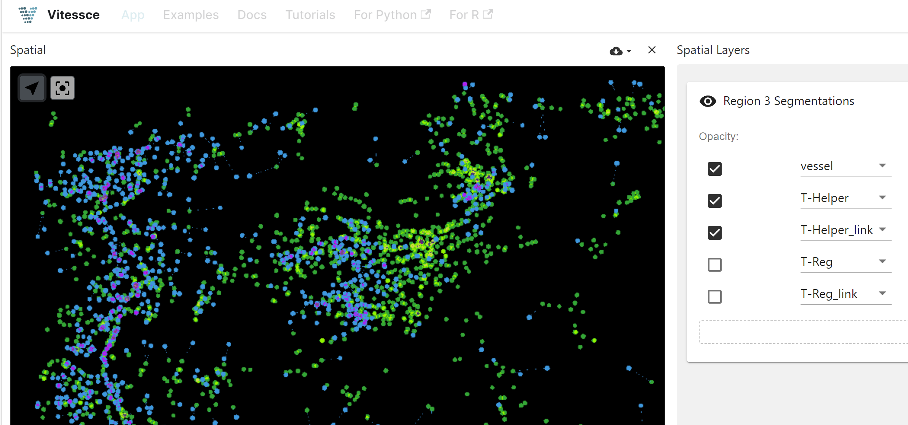
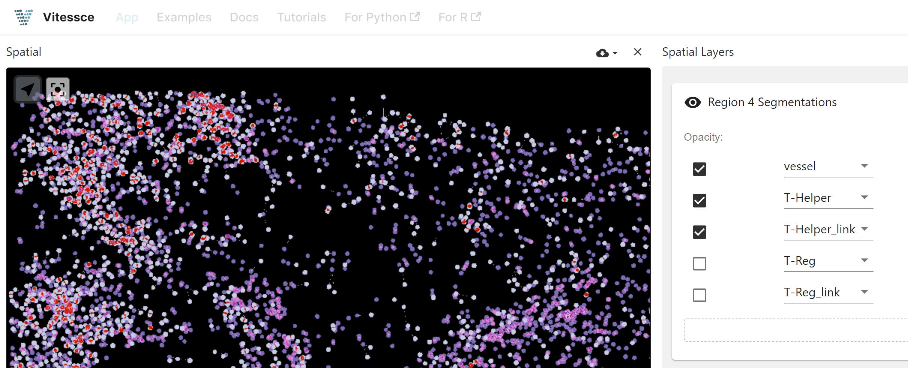
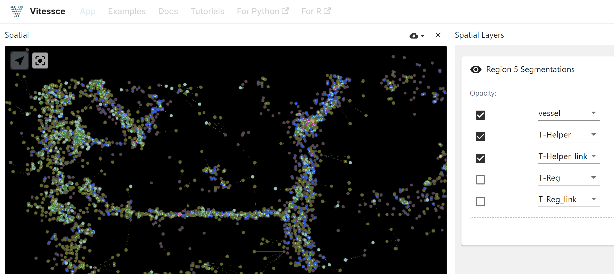
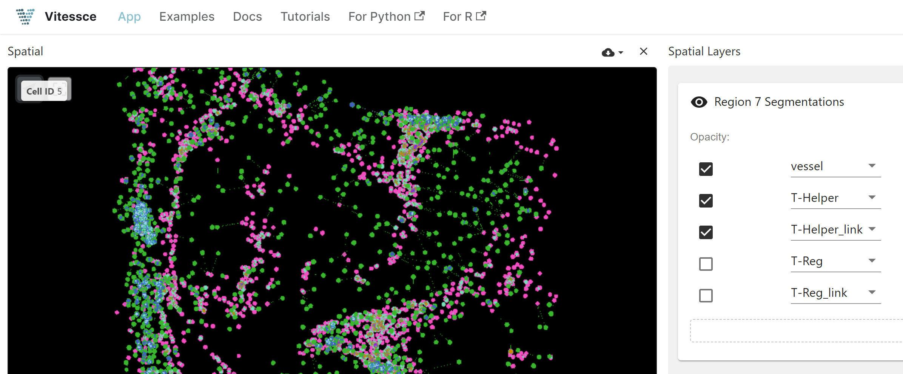
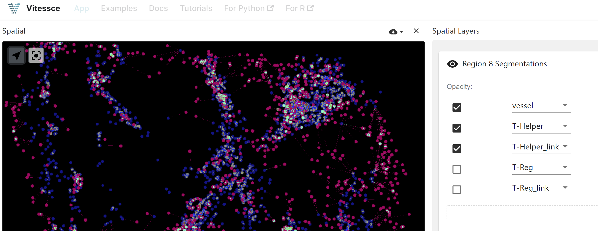
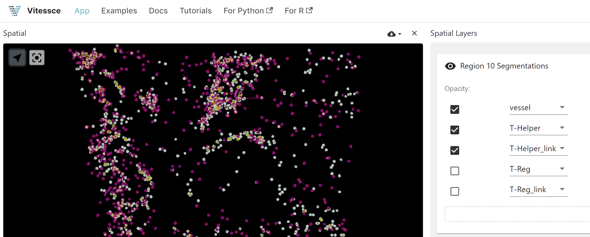
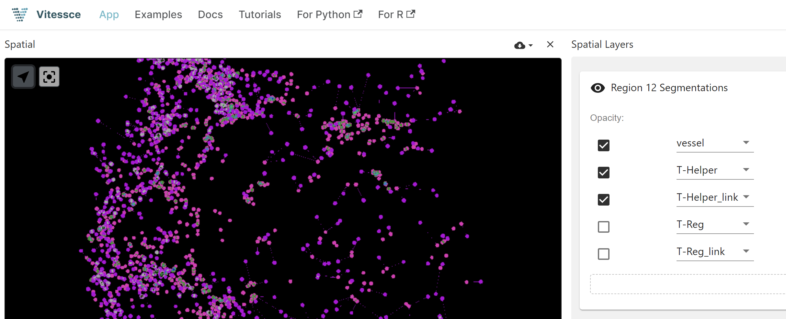

# VCCF Vitessce Preview

This page contains visualizations of skin images (Region 1 ~ 12) using Vitessce. Click the links below to view each visualization.

## Visualizations

Region 1: <a href="http://vitessce.io/#?theme=light&url=data:,%7B%22version%22%3A+%221.0.15%22%2C+%22name%22%3A+%22Transcriptomics+example%22%2C+%22description%22%3A+%22%22%2C+%22datasets%22%3A+%5B%7B%22uid%22%3A+%22A%22%2C+%22name%22%3A+%22Cell+segmentations%22%2C+%22files%22%3A+%5B%7B%22fileType%22%3A+%22raster.json%22%2C+%22options%22%3A+%7B%22schemaVersion%22%3A+%220.0.2%22%2C+%22images%22%3A+%5B%7B%22name%22%3A+%22Region+1+Segmentations%22%2C+%22type%22%3A+%22ome-tiff%22%2C+%22url%22%3A+%22https%3A%2F%2Fstoragetuzi.blob.core.windows.net%2Fblobtuzi%2Fcell_table_region_1.ome.tif%22%2C+%22metadata%22%3A+%7B%22isBitmask%22%3A+true%7D%7D%5D%7D%7D%5D%7D%5D%2C+%22coordinationSpace%22%3A+%7B%22dataset%22%3A+%7B%22A%22%3A+%22A%22%7D%2C+%22spatialZoom%22%3A+%7B%22A%22%3A+-4%7D%2C+%22spatialTargetX%22%3A+%7B%22A%22%3A+2000%7D%2C+%22spatialTargetY%22%3A+%7B%22A%22%3A+2000%7D%2C+%22spatialSegmentationLayer%22%3A+%7B%22A%22%3A+%5B%7B%22type%22%3A+%22bitmask%22%2C+%22index%22%3A+0%2C+%22visible%22%3A+true%2C+%22colormap%22%3A+null%2C+%22opacity%22%3A+1%2C+%22domainType%22%3A+%22Min%2FMax%22%2C+%22transparentColor%22%3A+%5B0%2C+0%2C+0%5D%2C+%22renderingMode%22%3A+%22Additive%22%2C+%22use3d%22%3A+false%2C+%22channels%22%3A+%5B%7B%22selection%22%3A+%7B%22c%22%3A+4%2C+%22t%22%3A+0%2C+%22z%22%3A+0%7D%2C+%22color%22%3A+%5B1%2C+0%2C+0%5D%2C+%22visible%22%3A+true%2C+%22slider%22%3A+%5B0%2C+1%5D%7D%2C+%7B%22selection%22%3A+%7B%22c%22%3A+1%2C+%22t%22%3A+0%2C+%22z%22%3A+0%7D%2C+%22color%22%3A+%5B0%2C+0%2C+1%5D%2C+%22visible%22%3A+true%2C+%22slider%22%3A+%5B0%2C+1%5D%7D%2C+%7B%22selection%22%3A+%7B%22c%22%3A+6%2C+%22t%22%3A+0%2C+%22z%22%3A+0%7D%2C+%22color%22%3A+%5B0%2C+0%2C+1%5D%2C+%22visible%22%3A+true%2C+%22slider%22%3A+%5B0%2C+1%5D%7D%2C+%7B%22selection%22%3A+%7B%22c%22%3A+2%2C+%22t%22%3A+0%2C+%22z%22%3A+0%7D%2C+%22color%22%3A+%5B0%2C+1%2C+0%5D%2C+%22visible%22%3A+false%2C+%22slider%22%3A+%5B0%2C+1%5D%7D%2C+%7B%22selection%22%3A+%7B%22c%22%3A+7%2C+%22t%22%3A+0%2C+%22z%22%3A+0%7D%2C+%22color%22%3A+%5B0%2C+1%2C+0%5D%2C+%22visible%22%3A+false%2C+%22slider%22%3A+%5B0%2C+1%5D%7D%5D%7D%5D%7D%7D%2C+%22layout%22%3A+%5B%7B%22component%22%3A+%22spatial%22%2C+%22coordinationScopes%22%3A+%7B%22dataset%22%3A+%22A%22%2C+%22spatialZoom%22%3A+%22A%22%2C+%22spatialTargetX%22%3A+%22A%22%2C+%22spatialTargetY%22%3A+%22A%22%2C+%22spatialSegmentationLayer%22%3A+%22A%22%7D%2C+%22x%22%3A+0.0%2C+%22y%22%3A+0%2C+%22w%22%3A+6.0%2C+%22h%22%3A+12%7D%2C+%7B%22component%22%3A+%22layerController%22%2C+%22coordinationScopes%22%3A+%7B%22dataset%22%3A+%22A%22%2C+%22spatialZoom%22%3A+%22A%22%2C+%22spatialTargetX%22%3A+%22A%22%2C+%22spatialTargetY%22%3A+%22A%22%2C+%22spatialSegmentationLayer%22%3A+%22A%22%7D%2C+%22x%22%3A+6.0%2C+%22y%22%3A+0%2C+%22w%22%3A+6.0%2C+%22h%22%3A+12%7D%5D%2C+%22initStrategy%22%3A+%22auto%22%7D" target="_blank">View Region 1 on Vitessce.io</a>
 

---

 

Region 2: <a href="http://vitessce.io/#?theme=light&url=data:,%7B%22version%22%3A+%221.0.15%22%2C+%22name%22%3A+%22Transcriptomics+example%22%2C+%22description%22%3A+%22%22%2C+%22datasets%22%3A+%5B%7B%22uid%22%3A+%22A%22%2C+%22name%22%3A+%22Cell+segmentations%22%2C+%22files%22%3A+%5B%7B%22fileType%22%3A+%22raster.json%22%2C+%22options%22%3A+%7B%22schemaVersion%22%3A+%220.0.2%22%2C+%22images%22%3A+%5B%7B%22name%22%3A+%22Region+2+Segmentations%22%2C+%22type%22%3A+%22ome-tiff%22%2C+%22url%22%3A+%22https%3A%2F%2Fstoragetuzi.blob.core.windows.net%2Fblobtuzi%2Fcell_table_region_2.ome.tif%22%2C+%22metadata%22%3A+%7B%22isBitmask%22%3A+true%7D%7D%5D%7D%7D%5D%7D%5D%2C+%22coordinationSpace%22%3A+%7B%22dataset%22%3A+%7B%22A%22%3A+%22A%22%7D%2C+%22spatialZoom%22%3A+%7B%22A%22%3A+-4%7D%2C+%22spatialTargetX%22%3A+%7B%22A%22%3A+2000%7D%2C+%22spatialTargetY%22%3A+%7B%22A%22%3A+2000%7D%2C+%22spatialSegmentationLayer%22%3A+%7B%22A%22%3A+%5B%7B%22type%22%3A+%22bitmask%22%2C+%22index%22%3A+0%2C+%22visible%22%3A+true%2C+%22colormap%22%3A+null%2C+%22opacity%22%3A+1%2C+%22domainType%22%3A+%22Min%2FMax%22%2C+%22transparentColor%22%3A+%5B0%2C+0%2C+0%5D%2C+%22renderingMode%22%3A+%22Additive%22%2C+%22use3d%22%3A+false%2C+%22channels%22%3A+%5B%7B%22selection%22%3A+%7B%22c%22%3A+4%2C+%22t%22%3A+0%2C+%22z%22%3A+0%7D%2C+%22color%22%3A+%5B1%2C+0%2C+0%5D%2C+%22visible%22%3A+true%2C+%22slider%22%3A+%5B0%2C+1%5D%7D%2C+%7B%22selection%22%3A+%7B%22c%22%3A+1%2C+%22t%22%3A+0%2C+%22z%22%3A+0%7D%2C+%22color%22%3A+%5B0%2C+0%2C+1%5D%2C+%22visible%22%3A+true%2C+%22slider%22%3A+%5B0%2C+1%5D%7D%2C+%7B%22selection%22%3A+%7B%22c%22%3A+6%2C+%22t%22%3A+0%2C+%22z%22%3A+0%7D%2C+%22color%22%3A+%5B0%2C+0%2C+1%5D%2C+%22visible%22%3A+true%2C+%22slider%22%3A+%5B0%2C+1%5D%7D%2C+%7B%22selection%22%3A+%7B%22c%22%3A+2%2C+%22t%22%3A+0%2C+%22z%22%3A+0%7D%2C+%22color%22%3A+%5B0%2C+1%2C+0%5D%2C+%22visible%22%3A+false%2C+%22slider%22%3A+%5B0%2C+1%5D%7D%2C+%7B%22selection%22%3A+%7B%22c%22%3A+7%2C+%22t%22%3A+0%2C+%22z%22%3A+0%7D%2C+%22color%22%3A+%5B0%2C+1%2C+0%5D%2C+%22visible%22%3A+false%2C+%22slider%22%3A+%5B0%2C+1%5D%7D%5D%7D%5D%7D%7D%2C+%22layout%22%3A+%5B%7B%22component%22%3A+%22spatial%22%2C+%22coordinationScopes%22%3A+%7B%22dataset%22%3A+%22A%22%2C+%22spatialZoom%22%3A+%22A%22%2C+%22spatialTargetX%22%3A+%22A%22%2C+%22spatialTargetY%22%3A+%22A%22%2C+%22spatialSegmentationLayer%22%3A+%22A%22%7D%2C+%22x%22%3A+0.0%2C+%22y%22%3A+0%2C+%22w%22%3A+6.0%2C+%22h%22%3A+12%7D%2C+%7B%22component%22%3A+%22layerController%22%2C+%22coordinationScopes%22%3A+%7B%22dataset%22%3A+%22A%22%2C+%22spatialZoom%22%3A+%22A%22%2C+%22spatialTargetX%22%3A+%22A%22%2C+%22spatialTargetY%22%3A+%22A%22%2C+%22spatialSegmentationLayer%22%3A+%22A%22%7D%2C+%22x%22%3A+6.0%2C+%22y%22%3A+0%2C+%22w%22%3A+6.0%2C+%22h%22%3A+12%7D%5D%2C+%22initStrategy%22%3A+%22auto%22%7D" target="_blank">View Region 2 on Vitessce.io</a>
 

---

 

Region 3: <a href="http://vitessce.io/#?theme=light&url=data:,%7B%22version%22%3A+%221.0.15%22%2C+%22name%22%3A+%22Transcriptomics+example%22%2C+%22description%22%3A+%22%22%2C+%22datasets%22%3A+%5B%7B%22uid%22%3A+%22A%22%2C+%22name%22%3A+%22Cell+segmentations%22%2C+%22files%22%3A+%5B%7B%22fileType%22%3A+%22raster.json%22%2C+%22options%22%3A+%7B%22schemaVersion%22%3A+%220.0.2%22%2C+%22images%22%3A+%5B%7B%22name%22%3A+%22Region+3+Segmentations%22%2C+%22type%22%3A+%22ome-tiff%22%2C+%22url%22%3A+%22https%3A%2F%2Fstoragetuzi.blob.core.windows.net%2Fblobtuzi%2Fcell_table_region_3.ome.tif%22%2C+%22metadata%22%3A+%7B%22isBitmask%22%3A+true%7D%7D%5D%7D%7D%5D%7D%5D%2C+%22coordinationSpace%22%3A+%7B%22dataset%22%3A+%7B%22A%22%3A+%22A%22%7D%2C+%22spatialZoom%22%3A+%7B%22A%22%3A+-4%7D%2C+%22spatialTargetX%22%3A+%7B%22A%22%3A+2000%7D%2C+%22spatialTargetY%22%3A+%7B%22A%22%3A+2000%7D%2C+%22spatialSegmentationLayer%22%3A+%7B%22A%22%3A+%5B%7B%22type%22%3A+%22bitmask%22%2C+%22index%22%3A+0%2C+%22visible%22%3A+true%2C+%22colormap%22%3A+null%2C+%22opacity%22%3A+1%2C+%22domainType%22%3A+%22Min%2FMax%22%2C+%22transparentColor%22%3A+%5B0%2C+0%2C+0%5D%2C+%22renderingMode%22%3A+%22Additive%22%2C+%22use3d%22%3A+false%2C+%22channels%22%3A+%5B%7B%22selection%22%3A+%7B%22c%22%3A+4%2C+%22t%22%3A+0%2C+%22z%22%3A+0%7D%2C+%22color%22%3A+%5B1%2C+0%2C+0%5D%2C+%22visible%22%3A+true%2C+%22slider%22%3A+%5B0%2C+1%5D%7D%2C+%7B%22selection%22%3A+%7B%22c%22%3A+1%2C+%22t%22%3A+0%2C+%22z%22%3A+0%7D%2C+%22color%22%3A+%5B0%2C+0%2C+1%5D%2C+%22visible%22%3A+true%2C+%22slider%22%3A+%5B0%2C+1%5D%7D%2C+%7B%22selection%22%3A+%7B%22c%22%3A+6%2C+%22t%22%3A+0%2C+%22z%22%3A+0%7D%2C+%22color%22%3A+%5B0%2C+0%2C+1%5D%2C+%22visible%22%3A+true%2C+%22slider%22%3A+%5B0%2C+1%5D%7D%2C+%7B%22selection%22%3A+%7B%22c%22%3A+2%2C+%22t%22%3A+0%2C+%22z%22%3A+0%7D%2C+%22color%22%3A+%5B0%2C+1%2C+0%5D%2C+%22visible%22%3A+false%2C+%22slider%22%3A+%5B0%2C+1%5D%7D%2C+%7B%22selection%22%3A+%7B%22c%22%3A+7%2C+%22t%22%3A+0%2C+%22z%22%3A+0%7D%2C+%22color%22%3A+%5B0%2C+1%2C+0%5D%2C+%22visible%22%3A+false%2C+%22slider%22%3A+%5B0%2C+1%5D%7D%5D%7D%5D%7D%7D%2C+%22layout%22%3A+%5B%7B%22component%22%3A+%22spatial%22%2C+%22coordinationScopes%22%3A+%7B%22dataset%22%3A+%22A%22%2C+%22spatialZoom%22%3A+%22A%22%2C+%22spatialTargetX%22%3A+%22A%22%2C+%22spatialTargetY%22%3A+%22A%22%2C+%22spatialSegmentationLayer%22%3A+%22A%22%7D%2C+%22x%22%3A+0.0%2C+%22y%22%3A+0%2C+%22w%22%3A+6.0%2C+%22h%22%3A+12%7D%2C+%7B%22component%22%3A+%22layerController%22%2C+%22coordinationScopes%22%3A+%7B%22dataset%22%3A+%22A%22%2C+%22spatialZoom%22%3A+%22A%22%2C+%22spatialTargetX%22%3A+%22A%22%2C+%22spatialTargetY%22%3A+%22A%22%2C+%22spatialSegmentationLayer%22%3A+%22A%22%7D%2C+%22x%22%3A+6.0%2C+%22y%22%3A+0%2C+%22w%22%3A+6.0%2C+%22h%22%3A+12%7D%5D%2C+%22initStrategy%22%3A+%22auto%22%7D" target="_blank">View Region 3 on Vitessce.io</a>
 

---

 

Region 4: <a href="http://vitessce.io/#?theme=light&url=data:,%7B%22version%22%3A+%221.0.15%22%2C+%22name%22%3A+%22Transcriptomics+example%22%2C+%22description%22%3A+%22%22%2C+%22datasets%22%3A+%5B%7B%22uid%22%3A+%22A%22%2C+%22name%22%3A+%22Cell+segmentations%22%2C+%22files%22%3A+%5B%7B%22fileType%22%3A+%22raster.json%22%2C+%22options%22%3A+%7B%22schemaVersion%22%3A+%220.0.2%22%2C+%22images%22%3A+%5B%7B%22name%22%3A+%22Region+4+Segmentations%22%2C+%22type%22%3A+%22ome-tiff%22%2C+%22url%22%3A+%22https%3A%2F%2Fstoragetuzi.blob.core.windows.net%2Fblobtuzi%2Fcell_table_region_4.ome.tif%22%2C+%22metadata%22%3A+%7B%22isBitmask%22%3A+true%7D%7D%5D%7D%7D%5D%7D%5D%2C+%22coordinationSpace%22%3A+%7B%22dataset%22%3A+%7B%22A%22%3A+%22A%22%7D%2C+%22spatialZoom%22%3A+%7B%22A%22%3A+-4%7D%2C+%22spatialTargetX%22%3A+%7B%22A%22%3A+2000%7D%2C+%22spatialTargetY%22%3A+%7B%22A%22%3A+2000%7D%2C+%22spatialSegmentationLayer%22%3A+%7B%22A%22%3A+%5B%7B%22type%22%3A+%22bitmask%22%2C+%22index%22%3A+0%2C+%22visible%22%3A+true%2C+%22colormap%22%3A+null%2C+%22opacity%22%3A+1%2C+%22domainType%22%3A+%22Min%2FMax%22%2C+%22transparentColor%22%3A+%5B0%2C+0%2C+0%5D%2C+%22renderingMode%22%3A+%22Additive%22%2C+%22use3d%22%3A+false%2C+%22channels%22%3A+%5B%7B%22selection%22%3A+%7B%22c%22%3A+4%2C+%22t%22%3A+0%2C+%22z%22%3A+0%7D%2C+%22color%22%3A+%5B1%2C+0%2C+0%5D%2C+%22visible%22%3A+true%2C+%22slider%22%3A+%5B0%2C+1%5D%7D%2C+%7B%22selection%22%3A+%7B%22c%22%3A+1%2C+%22t%22%3A+0%2C+%22z%22%3A+0%7D%2C+%22color%22%3A+%5B0%2C+0%2C+1%5D%2C+%22visible%22%3A+true%2C+%22slider%22%3A+%5B0%2C+1%5D%7D%2C+%7B%22selection%22%3A+%7B%22c%22%3A+6%2C+%22t%22%3A+0%2C+%22z%22%3A+0%7D%2C+%22color%22%3A+%5B0%2C+0%2C+1%5D%2C+%22visible%22%3A+true%2C+%22slider%22%3A+%5B0%2C+1%5D%7D%2C+%7B%22selection%22%3A+%7B%22c%22%3A+2%2C+%22t%22%3A+0%2C+%22z%22%3A+0%7D%2C+%22color%22%3A+%5B0%2C+1%2C+0%5D%2C+%22visible%22%3A+false%2C+%22slider%22%3A+%5B0%2C+1%5D%7D%2C+%7B%22selection%22%3A+%7B%22c%22%3A+7%2C+%22t%22%3A+0%2C+%22z%22%3A+0%7D%2C+%22color%22%3A+%5B0%2C+1%2C+0%5D%2C+%22visible%22%3A+false%2C+%22slider%22%3A+%5B0%2C+1%5D%7D%5D%7D%5D%7D%7D%2C+%22layout%22%3A+%5B%7B%22component%22%3A+%22spatial%22%2C+%22coordinationScopes%22%3A+%7B%22dataset%22%3A+%22A%22%2C+%22spatialZoom%22%3A+%22A%22%2C+%22spatialTargetX%22%3A+%22A%22%2C+%22spatialTargetY%22%3A+%22A%22%2C+%22spatialSegmentationLayer%22%3A+%22A%22%7D%2C+%22x%22%3A+0.0%2C+%22y%22%3A+0%2C+%22w%22%3A+6.0%2C+%22h%22%3A+12%7D%2C+%7B%22component%22%3A+%22layerController%22%2C+%22coordinationScopes%22%3A+%7B%22dataset%22%3A+%22A%22%2C+%22spatialZoom%22%3A+%22A%22%2C+%22spatialTargetX%22%3A+%22A%22%2C+%22spatialTargetY%22%3A+%22A%22%2C+%22spatialSegmentationLayer%22%3A+%22A%22%7D%2C+%22x%22%3A+6.0%2C+%22y%22%3A+0%2C+%22w%22%3A+6.0%2C+%22h%22%3A+12%7D%5D%2C+%22initStrategy%22%3A+%22auto%22%7D" target="_blank">View Region 4 on Vitessce.io</a>
 

---

 

Region 5: <a href="http://vitessce.io/#?theme=light&url=data:,%7B%22version%22%3A+%221.0.15%22%2C+%22name%22%3A+%22Transcriptomics+example%22%2C+%22description%22%3A+%22%22%2C+%22datasets%22%3A+%5B%7B%22uid%22%3A+%22A%22%2C+%22name%22%3A+%22Cell+segmentations%22%2C+%22files%22%3A+%5B%7B%22fileType%22%3A+%22raster.json%22%2C+%22options%22%3A+%7B%22schemaVersion%22%3A+%220.0.2%22%2C+%22images%22%3A+%5B%7B%22name%22%3A+%22Region+5+Segmentations%22%2C+%22type%22%3A+%22ome-tiff%22%2C+%22url%22%3A+%22https%3A%2F%2Fstoragetuzi.blob.core.windows.net%2Fblobtuzi%2Fcell_table_region_5.ome.tif%22%2C+%22metadata%22%3A+%7B%22isBitmask%22%3A+true%7D%7D%5D%7D%7D%5D%7D%5D%2C+%22coordinationSpace%22%3A+%7B%22dataset%22%3A+%7B%22A%22%3A+%22A%22%7D%2C+%22spatialZoom%22%3A+%7B%22A%22%3A+-4%7D%2C+%22spatialTargetX%22%3A+%7B%22A%22%3A+2000%7D%2C+%22spatialTargetY%22%3A+%7B%22A%22%3A+2000%7D%2C+%22spatialSegmentationLayer%22%3A+%7B%22A%22%3A+%5B%7B%22type%22%3A+%22bitmask%22%2C+%22index%22%3A+0%2C+%22visible%22%3A+true%2C+%22colormap%22%3A+null%2C+%22opacity%22%3A+1%2C+%22domainType%22%3A+%22Min%2FMax%22%2C+%22transparentColor%22%3A+%5B0%2C+0%2C+0%5D%2C+%22renderingMode%22%3A+%22Additive%22%2C+%22use3d%22%3A+false%2C+%22channels%22%3A+%5B%7B%22selection%22%3A+%7B%22c%22%3A+4%2C+%22t%22%3A+0%2C+%22z%22%3A+0%7D%2C+%22color%22%3A+%5B1%2C+0%2C+0%5D%2C+%22visible%22%3A+true%2C+%22slider%22%3A+%5B0%2C+1%5D%7D%2C+%7B%22selection%22%3A+%7B%22c%22%3A+1%2C+%22t%22%3A+0%2C+%22z%22%3A+0%7D%2C+%22color%22%3A+%5B0%2C+0%2C+1%5D%2C+%22visible%22%3A+true%2C+%22slider%22%3A+%5B0%2C+1%5D%7D%2C+%7B%22selection%22%3A+%7B%22c%22%3A+6%2C+%22t%22%3A+0%2C+%22z%22%3A+0%7D%2C+%22color%22%3A+%5B0%2C+0%2C+1%5D%2C+%22visible%22%3A+true%2C+%22slider%22%3A+%5B0%2C+1%5D%7D%2C+%7B%22selection%22%3A+%7B%22c%22%3A+2%2C+%22t%22%3A+0%2C+%22z%22%3A+0%7D%2C+%22color%22%3A+%5B0%2C+1%2C+0%5D%2C+%22visible%22%3A+false%2C+%22slider%22%3A+%5B0%2C+1%5D%7D%2C+%7B%22selection%22%3A+%7B%22c%22%3A+7%2C+%22t%22%3A+0%2C+%22z%22%3A+0%7D%2C+%22color%22%3A+%5B0%2C+1%2C+0%5D%2C+%22visible%22%3A+false%2C+%22slider%22%3A+%5B0%2C+1%5D%7D%5D%7D%5D%7D%7D%2C+%22layout%22%3A+%5B%7B%22component%22%3A+%22spatial%22%2C+%22coordinationScopes%22%3A+%7B%22dataset%22%3A+%22A%22%2C+%22spatialZoom%22%3A+%22A%22%2C+%22spatialTargetX%22%3A+%22A%22%2C+%22spatialTargetY%22%3A+%22A%22%2C+%22spatialSegmentationLayer%22%3A+%22A%22%7D%2C+%22x%22%3A+0.0%2C+%22y%22%3A+0%2C+%22w%22%3A+6.0%2C+%22h%22%3A+12%7D%2C+%7B%22component%22%3A+%22layerController%22%2C+%22coordinationScopes%22%3A+%7B%22dataset%22%3A+%22A%22%2C+%22spatialZoom%22%3A+%22A%22%2C+%22spatialTargetX%22%3A+%22A%22%2C+%22spatialTargetY%22%3A+%22A%22%2C+%22spatialSegmentationLayer%22%3A+%22A%22%7D%2C+%22x%22%3A+6.0%2C+%22y%22%3A+0%2C+%22w%22%3A+6.0%2C+%22h%22%3A+12%7D%5D%2C+%22initStrategy%22%3A+%22auto%22%7D" target="_blank">View Region 5 on Vitessce.io</a>
 

---

 

Region 7: <a href="http://vitessce.io/#?theme=light&url=data:,%7B%22version%22%3A+%221.0.15%22%2C+%22name%22%3A+%22Transcriptomics+example%22%2C+%22description%22%3A+%22%22%2C+%22datasets%22%3A+%5B%7B%22uid%22%3A+%22A%22%2C+%22name%22%3A+%22Cell+segmentations%22%2C+%22files%22%3A+%5B%7B%22fileType%22%3A+%22raster.json%22%2C+%22options%22%3A+%7B%22schemaVersion%22%3A+%220.0.2%22%2C+%22images%22%3A+%5B%7B%22name%22%3A+%22Region+7+Segmentations%22%2C+%22type%22%3A+%22ome-tiff%22%2C+%22url%22%3A+%22https%3A%2F%2Fstoragetuzi.blob.core.windows.net%2Fblobtuzi%2Fcell_table_region_7.ome.tif%22%2C+%22metadata%22%3A+%7B%22isBitmask%22%3A+true%7D%7D%5D%7D%7D%5D%7D%5D%2C+%22coordinationSpace%22%3A+%7B%22dataset%22%3A+%7B%22A%22%3A+%22A%22%7D%2C+%22spatialZoom%22%3A+%7B%22A%22%3A+-4%7D%2C+%22spatialTargetX%22%3A+%7B%22A%22%3A+2000%7D%2C+%22spatialTargetY%22%3A+%7B%22A%22%3A+2000%7D%2C+%22spatialSegmentationLayer%22%3A+%7B%22A%22%3A+%5B%7B%22type%22%3A+%22bitmask%22%2C+%22index%22%3A+0%2C+%22visible%22%3A+true%2C+%22colormap%22%3A+null%2C+%22opacity%22%3A+1%2C+%22domainType%22%3A+%22Min%2FMax%22%2C+%22transparentColor%22%3A+%5B0%2C+0%2C+0%5D%2C+%22renderingMode%22%3A+%22Additive%22%2C+%22use3d%22%3A+false%2C+%22channels%22%3A+%5B%7B%22selection%22%3A+%7B%22c%22%3A+4%2C+%22t%22%3A+0%2C+%22z%22%3A+0%7D%2C+%22color%22%3A+%5B1%2C+0%2C+0%5D%2C+%22visible%22%3A+true%2C+%22slider%22%3A+%5B0%2C+1%5D%7D%2C+%7B%22selection%22%3A+%7B%22c%22%3A+1%2C+%22t%22%3A+0%2C+%22z%22%3A+0%7D%2C+%22color%22%3A+%5B0%2C+0%2C+1%5D%2C+%22visible%22%3A+true%2C+%22slider%22%3A+%5B0%2C+1%5D%7D%2C+%7B%22selection%22%3A+%7B%22c%22%3A+6%2C+%22t%22%3A+0%2C+%22z%22%3A+0%7D%2C+%22color%22%3A+%5B0%2C+0%2C+1%5D%2C+%22visible%22%3A+true%2C+%22slider%22%3A+%5B0%2C+1%5D%7D%2C+%7B%22selection%22%3A+%7B%22c%22%3A+2%2C+%22t%22%3A+0%2C+%22z%22%3A+0%7D%2C+%22color%22%3A+%5B0%2C+1%2C+0%5D%2C+%22visible%22%3A+false%2C+%22slider%22%3A+%5B0%2C+1%5D%7D%2C+%7B%22selection%22%3A+%7B%22c%22%3A+7%2C+%22t%22%3A+0%2C+%22z%22%3A+0%7D%2C+%22color%22%3A+%5B0%2C+1%2C+0%5D%2C+%22visible%22%3A+false%2C+%22slider%22%3A+%5B0%2C+1%5D%7D%5D%7D%5D%7D%7D%2C+%22layout%22%3A+%5B%7B%22component%22%3A+%22spatial%22%2C+%22coordinationScopes%22%3A+%7B%22dataset%22%3A+%22A%22%2C+%22spatialZoom%22%3A+%22A%22%2C+%22spatialTargetX%22%3A+%22A%22%2C+%22spatialTargetY%22%3A+%22A%22%2C+%22spatialSegmentationLayer%22%3A+%22A%22%7D%2C+%22x%22%3A+0.0%2C+%22y%22%3A+0%2C+%22w%22%3A+6.0%2C+%22h%22%3A+12%7D%2C+%7B%22component%22%3A+%22layerController%22%2C+%22coordinationScopes%22%3A+%7B%22dataset%22%3A+%22A%22%2C+%22spatialZoom%22%3A+%22A%22%2C+%22spatialTargetX%22%3A+%22A%22%2C+%22spatialTargetY%22%3A+%22A%22%2C+%22spatialSegmentationLayer%22%3A+%22A%22%7D%2C+%22x%22%3A+6.0%2C+%22y%22%3A+0%2C+%22w%22%3A+6.0%2C+%22h%22%3A+12%7D%5D%2C+%22initStrategy%22%3A+%22auto%22%7D" target="_blank">View Region 7 on Vitessce.io</a>
 

---

 

Region 8: <a href="http://vitessce.io/#?theme=light&url=data:,%7B%22version%22%3A+%221.0.15%22%2C+%22name%22%3A+%22Transcriptomics+example%22%2C+%22description%22%3A+%22%22%2C+%22datasets%22%3A+%5B%7B%22uid%22%3A+%22A%22%2C+%22name%22%3A+%22Cell+segmentations%22%2C+%22files%22%3A+%5B%7B%22fileType%22%3A+%22raster.json%22%2C+%22options%22%3A+%7B%22schemaVersion%22%3A+%220.0.2%22%2C+%22images%22%3A+%5B%7B%22name%22%3A+%22Region+8+Segmentations%22%2C+%22type%22%3A+%22ome-tiff%22%2C+%22url%22%3A+%22https%3A%2F%2Fstoragetuzi.blob.core.windows.net%2Fblobtuzi%2Fcell_table_region_8.ome.tif%22%2C+%22metadata%22%3A+%7B%22isBitmask%22%3A+true%7D%7D%5D%7D%7D%5D%7D%5D%2C+%22coordinationSpace%22%3A+%7B%22dataset%22%3A+%7B%22A%22%3A+%22A%22%7D%2C+%22spatialZoom%22%3A+%7B%22A%22%3A+-4%7D%2C+%22spatialTargetX%22%3A+%7B%22A%22%3A+2000%7D%2C+%22spatialTargetY%22%3A+%7B%22A%22%3A+2000%7D%2C+%22spatialSegmentationLayer%22%3A+%7B%22A%22%3A+%5B%7B%22type%22%3A+%22bitmask%22%2C+%22index%22%3A+0%2C+%22visible%22%3A+true%2C+%22colormap%22%3A+null%2C+%22opacity%22%3A+1%2C+%22domainType%22%3A+%22Min%2FMax%22%2C+%22transparentColor%22%3A+%5B0%2C+0%2C+0%5D%2C+%22renderingMode%22%3A+%22Additive%22%2C+%22use3d%22%3A+false%2C+%22channels%22%3A+%5B%7B%22selection%22%3A+%7B%22c%22%3A+4%2C+%22t%22%3A+0%2C+%22z%22%3A+0%7D%2C+%22color%22%3A+%5B1%2C+0%2C+0%5D%2C+%22visible%22%3A+true%2C+%22slider%22%3A+%5B0%2C+1%5D%7D%2C+%7B%22selection%22%3A+%7B%22c%22%3A+1%2C+%22t%22%3A+0%2C+%22z%22%3A+0%7D%2C+%22color%22%3A+%5B0%2C+0%2C+1%5D%2C+%22visible%22%3A+true%2C+%22slider%22%3A+%5B0%2C+1%5D%7D%2C+%7B%22selection%22%3A+%7B%22c%22%3A+6%2C+%22t%22%3A+0%2C+%22z%22%3A+0%7D%2C+%22color%22%3A+%5B0%2C+0%2C+1%5D%2C+%22visible%22%3A+true%2C+%22slider%22%3A+%5B0%2C+1%5D%7D%2C+%7B%22selection%22%3A+%7B%22c%22%3A+2%2C+%22t%22%3A+0%2C+%22z%22%3A+0%7D%2C+%22color%22%3A+%5B0%2C+1%2C+0%5D%2C+%22visible%22%3A+false%2C+%22slider%22%3A+%5B0%2C+1%5D%7D%2C+%7B%22selection%22%3A+%7B%22c%22%3A+7%2C+%22t%22%3A+0%2C+%22z%22%3A+0%7D%2C+%22color%22%3A+%5B0%2C+1%2C+0%5D%2C+%22visible%22%3A+false%2C+%22slider%22%3A+%5B0%2C+1%5D%7D%5D%7D%5D%7D%7D%2C+%22layout%22%3A+%5B%7B%22component%22%3A+%22spatial%22%2C+%22coordinationScopes%22%3A+%7B%22dataset%22%3A+%22A%22%2C+%22spatialZoom%22%3A+%22A%22%2C+%22spatialTargetX%22%3A+%22A%22%2C+%22spatialTargetY%22%3A+%22A%22%2C+%22spatialSegmentationLayer%22%3A+%22A%22%7D%2C+%22x%22%3A+0.0%2C+%22y%22%3A+0%2C+%22w%22%3A+6.0%2C+%22h%22%3A+12%7D%2C+%7B%22component%22%3A+%22layerController%22%2C+%22coordinationScopes%22%3A+%7B%22dataset%22%3A+%22A%22%2C+%22spatialZoom%22%3A+%22A%22%2C+%22spatialTargetX%22%3A+%22A%22%2C+%22spatialTargetY%22%3A+%22A%22%2C+%22spatialSegmentationLayer%22%3A+%22A%22%7D%2C+%22x%22%3A+6.0%2C+%22y%22%3A+0%2C+%22w%22%3A+6.0%2C+%22h%22%3A+12%7D%5D%2C+%22initStrategy%22%3A+%22auto%22%7D" target="_blank">View Region 8 on Vitessce.io</a>
 

---

 

Region 9: <a href="http://vitessce.io/#?theme=light&url=data:,%7B%22version%22%3A+%221.0.15%22%2C+%22name%22%3A+%22Transcriptomics+example%22%2C+%22description%22%3A+%22%22%2C+%22datasets%22%3A+%5B%7B%22uid%22%3A+%22A%22%2C+%22name%22%3A+%22Cell+segmentations%22%2C+%22files%22%3A+%5B%7B%22fileType%22%3A+%22raster.json%22%2C+%22options%22%3A+%7B%22schemaVersion%22%3A+%220.0.2%22%2C+%22images%22%3A+%5B%7B%22name%22%3A+%22Region+9+Segmentations%22%2C+%22type%22%3A+%22ome-tiff%22%2C+%22url%22%3A+%22https%3A%2F%2Fstoragetuzi.blob.core.windows.net%2Fblobtuzi%2Fcell_table_region_9.ome.tif%22%2C+%22metadata%22%3A+%7B%22isBitmask%22%3A+true%7D%7D%5D%7D%7D%5D%7D%5D%2C+%22coordinationSpace%22%3A+%7B%22dataset%22%3A+%7B%22A%22%3A+%22A%22%7D%2C+%22spatialZoom%22%3A+%7B%22A%22%3A+-4%7D%2C+%22spatialTargetX%22%3A+%7B%22A%22%3A+2000%7D%2C+%22spatialTargetY%22%3A+%7B%22A%22%3A+2000%7D%2C+%22spatialSegmentationLayer%22%3A+%7B%22A%22%3A+%5B%7B%22type%22%3A+%22bitmask%22%2C+%22index%22%3A+0%2C+%22visible%22%3A+true%2C+%22colormap%22%3A+null%2C+%22opacity%22%3A+1%2C+%22domainType%22%3A+%22Min%2FMax%22%2C+%22transparentColor%22%3A+%5B0%2C+0%2C+0%5D%2C+%22renderingMode%22%3A+%22Additive%22%2C+%22use3d%22%3A+false%2C+%22channels%22%3A+%5B%7B%22selection%22%3A+%7B%22c%22%3A+4%2C+%22t%22%3A+0%2C+%22z%22%3A+0%7D%2C+%22color%22%3A+%5B1%2C+0%2C+0%5D%2C+%22visible%22%3A+true%2C+%22slider%22%3A+%5B0%2C+1%5D%7D%2C+%7B%22selection%22%3A+%7B%22c%22%3A+1%2C+%22t%22%3A+0%2C+%22z%22%3A+0%7D%2C+%22color%22%3A+%5B0%2C+0%2C+1%5D%2C+%22visible%22%3A+true%2C+%22slider%22%3A+%5B0%2C+1%5D%7D%2C+%7B%22selection%22%3A+%7B%22c%22%3A+6%2C+%22t%22%3A+0%2C+%22z%22%3A+0%7D%2C+%22color%22%3A+%5B0%2C+0%2C+1%5D%2C+%22visible%22%3A+true%2C+%22slider%22%3A+%5B0%2C+1%5D%7D%2C+%7B%22selection%22%3A+%7B%22c%22%3A+2%2C+%22t%22%3A+0%2C+%22z%22%3A+0%7D%2C+%22color%22%3A+%5B0%2C+1%2C+0%5D%2C+%22visible%22%3A+false%2C+%22slider%22%3A+%5B0%2C+1%5D%7D%2C+%7B%22selection%22%3A+%7B%22c%22%3A+7%2C+%22t%22%3A+0%2C+%22z%22%3A+0%7D%2C+%22color%22%3A+%5B0%2C+1%2C+0%5D%2C+%22visible%22%3A+false%2C+%22slider%22%3A+%5B0%2C+1%5D%7D%5D%7D%5D%7D%7D%2C+%22layout%22%3A+%5B%7B%22component%22%3A+%22spatial%22%2C+%22coordinationScopes%22%3A+%7B%22dataset%22%3A+%22A%22%2C+%22spatialZoom%22%3A+%22A%22%2C+%22spatialTargetX%22%3A+%22A%22%2C+%22spatialTargetY%22%3A+%22A%22%2C+%22spatialSegmentationLayer%22%3A+%22A%22%7D%2C+%22x%22%3A+0.0%2C+%22y%22%3A+0%2C+%22w%22%3A+6.0%2C+%22h%22%3A+12%7D%2C+%7B%22component%22%3A+%22layerController%22%2C+%22coordinationScopes%22%3A+%7B%22dataset%22%3A+%22A%22%2C+%22spatialZoom%22%3A+%22A%22%2C+%22spatialTargetX%22%3A+%22A%22%2C+%22spatialTargetY%22%3A+%22A%22%2C+%22spatialSegmentationLayer%22%3A+%22A%22%7D%2C+%22x%22%3A+6.0%2C+%22y%22%3A+0%2C+%22w%22%3A+6.0%2C+%22h%22%3A+12%7D%5D%2C+%22initStrategy%22%3A+%22auto%22%7D" target="_blank">View Region 9 on Vitessce.io</a>
 

---

 

Region 10: <a href="http://vitessce.io/#?theme=light&url=data:,%7B%22version%22%3A+%221.0.15%22%2C+%22name%22%3A+%22Transcriptomics+example%22%2C+%22description%22%3A+%22%22%2C+%22datasets%22%3A+%5B%7B%22uid%22%3A+%22A%22%2C+%22name%22%3A+%22Cell+segmentations%22%2C+%22files%22%3A+%5B%7B%22fileType%22%3A+%22raster.json%22%2C+%22options%22%3A+%7B%22schemaVersion%22%3A+%220.0.2%22%2C+%22images%22%3A+%5B%7B%22name%22%3A+%22Region+10+Segmentations%22%2C+%22type%22%3A+%22ome-tiff%22%2C+%22url%22%3A+%22https%3A%2F%2Fstoragetuzi.blob.core.windows.net%2Fblobtuzi%2Fcell_table_region_10.ome.tif%22%2C+%22metadata%22%3A+%7B%22isBitmask%22%3A+true%7D%7D%5D%7D%7D%5D%7D%5D%2C+%22coordinationSpace%22%3A+%7B%22dataset%22%3A+%7B%22A%22%3A+%22A%22%7D%2C+%22spatialZoom%22%3A+%7B%22A%22%3A+-4%7D%2C+%22spatialTargetX%22%3A+%7B%22A%22%3A+2000%7D%2C+%22spatialTargetY%22%3A+%7B%22A%22%3A+2000%7D%2C+%22spatialSegmentationLayer%22%3A+%7B%22A%22%3A+%5B%7B%22type%22%3A+%22bitmask%22%2C+%22index%22%3A+0%2C+%22visible%22%3A+true%2C+%22colormap%22%3A+null%2C+%22opacity%22%3A+1%2C+%22domainType%22%3A+%22Min%2FMax%22%2C+%22transparentColor%22%3A+%5B0%2C+0%2C+0%5D%2C+%22renderingMode%22%3A+%22Additive%22%2C+%22use3d%22%3A+false%2C+%22channels%22%3A+%5B%7B%22selection%22%3A+%7B%22c%22%3A+4%2C+%22t%22%3A+0%2C+%22z%22%3A+0%7D%2C+%22color%22%3A+%5B1%2C+0%2C+0%5D%2C+%22visible%22%3A+true%2C+%22slider%22%3A+%5B0%2C+1%5D%7D%2C+%7B%22selection%22%3A+%7B%22c%22%3A+1%2C+%22t%22%3A+0%2C+%22z%22%3A+0%7D%2C+%22color%22%3A+%5B0%2C+0%2C+1%5D%2C+%22visible%22%3A+true%2C+%22slider%22%3A+%5B0%2C+1%5D%7D%2C+%7B%22selection%22%3A+%7B%22c%22%3A+6%2C+%22t%22%3A+0%2C+%22z%22%3A+0%7D%2C+%22color%22%3A+%5B0%2C+0%2C+1%5D%2C+%22visible%22%3A+true%2C+%22slider%22%3A+%5B0%2C+1%5D%7D%2C+%7B%22selection%22%3A+%7B%22c%22%3A+2%2C+%22t%22%3A+0%2C+%22z%22%3A+0%7D%2C+%22color%22%3A+%5B0%2C+1%2C+0%5D%2C+%22visible%22%3A+false%2C+%22slider%22%3A+%5B0%2C+1%5D%7D%2C+%7B%22selection%22%3A+%7B%22c%22%3A+7%2C+%22t%22%3A+0%2C+%22z%22%3A+0%7D%2C+%22color%22%3A+%5B0%2C+1%2C+0%5D%2C+%22visible%22%3A+false%2C+%22slider%22%3A+%5B0%2C+1%5D%7D%5D%7D%5D%7D%7D%2C+%22layout%22%3A+%5B%7B%22component%22%3A+%22spatial%22%2C+%22coordinationScopes%22%3A+%7B%22dataset%22%3A+%22A%22%2C+%22spatialZoom%22%3A+%22A%22%2C+%22spatialTargetX%22%3A+%22A%22%2C+%22spatialTargetY%22%3A+%22A%22%2C+%22spatialSegmentationLayer%22%3A+%22A%22%7D%2C+%22x%22%3A+0.0%2C+%22y%22%3A+0%2C+%22w%22%3A+6.0%2C+%22h%22%3A+12%7D%2C+%7B%22component%22%3A+%22layerController%22%2C+%22coordinationScopes%22%3A+%7B%22dataset%22%3A+%22A%22%2C+%22spatialZoom%22%3A+%22A%22%2C+%22spatialTargetX%22%3A+%22A%22%2C+%22spatialTargetY%22%3A+%22A%22%2C+%22spatialSegmentationLayer%22%3A+%22A%22%7D%2C+%22x%22%3A+6.0%2C+%22y%22%3A+0%2C+%22w%22%3A+6.0%2C+%22h%22%3A+12%7D%5D%2C+%22initStrategy%22%3A+%22auto%22%7D" target="_blank">View Region 10 on Vitessce.io</a>
 

---

 

Region 11: <a href="http://vitessce.io/#?theme=light&url=data:,%7B%22version%22%3A+%221.0.15%22%2C+%22name%22%3A+%22Transcriptomics+example%22%2C+%22description%22%3A+%22%22%2C+%22datasets%22%3A+%5B%7B%22uid%22%3A+%22A%22%2C+%22name%22%3A+%22Cell+segmentations%22%2C+%22files%22%3A+%5B%7B%22fileType%22%3A+%22raster.json%22%2C+%22options%22%3A+%7B%22schemaVersion%22%3A+%220.0.2%22%2C+%22images%22%3A+%5B%7B%22name%22%3A+%22Region+11+Segmentations%22%2C+%22type%22%3A+%22ome-tiff%22%2C+%22url%22%3A+%22https%3A%2F%2Fstoragetuzi.blob.core.windows.net%2Fblobtuzi%2Fcell_table_region_11.ome.tif%22%2C+%22metadata%22%3A+%7B%22isBitmask%22%3A+true%7D%7D%5D%7D%7D%5D%7D%5D%2C+%22coordinationSpace%22%3A+%7B%22dataset%22%3A+%7B%22A%22%3A+%22A%22%7D%2C+%22spatialZoom%22%3A+%7B%22A%22%3A+-4%7D%2C+%22spatialTargetX%22%3A+%7B%22A%22%3A+2000%7D%2C+%22spatialTargetY%22%3A+%7B%22A%22%3A+2000%7D%2C+%22spatialSegmentationLayer%22%3A+%7B%22A%22%3A+%5B%7B%22type%22%3A+%22bitmask%22%2C+%22index%22%3A+0%2C+%22visible%22%3A+true%2C+%22colormap%22%3A+null%2C+%22opacity%22%3A+1%2C+%22domainType%22%3A+%22Min%2FMax%22%2C+%22transparentColor%22%3A+%5B0%2C+0%2C+0%5D%2C+%22renderingMode%22%3A+%22Additive%22%2C+%22use3d%22%3A+false%2C+%22channels%22%3A+%5B%7B%22selection%22%3A+%7B%22c%22%3A+4%2C+%22t%22%3A+0%2C+%22z%22%3A+0%7D%2C+%22color%22%3A+%5B1%2C+0%2C+0%5D%2C+%22visible%22%3A+true%2C+%22slider%22%3A+%5B0%2C+1%5D%7D%2C+%7B%22selection%22%3A+%7B%22c%22%3A+1%2C+%22t%22%3A+0%2C+%22z%22%3A+0%7D%2C+%22color%22%3A+%5B0%2C+0%2C+1%5D%2C+%22visible%22%3A+true%2C+%22slider%22%3A+%5B0%2C+1%5D%7D%2C+%7B%22selection%22%3A+%7B%22c%22%3A+6%2C+%22t%22%3A+0%2C+%22z%22%3A+0%7D%2C+%22color%22%3A+%5B0%2C+0%2C+1%5D%2C+%22visible%22%3A+true%2C+%22slider%22%3A+%5B0%2C+1%5D%7D%2C+%7B%22selection%22%3A+%7B%22c%22%3A+2%2C+%22t%22%3A+0%2C+%22z%22%3A+0%7D%2C+%22color%22%3A+%5B0%2C+1%2C+0%5D%2C+%22visible%22%3A+false%2C+%22slider%22%3A+%5B0%2C+1%5D%7D%2C+%7B%22selection%22%3A+%7B%22c%22%3A+7%2C+%22t%22%3A+0%2C+%22z%22%3A+0%7D%2C+%22color%22%3A+%5B0%2C+1%2C+0%5D%2C+%22visible%22%3A+false%2C+%22slider%22%3A+%5B0%2C+1%5D%7D%5D%7D%5D%7D%7D%2C+%22layout%22%3A+%5B%7B%22component%22%3A+%22spatial%22%2C+%22coordinationScopes%22%3A+%7B%22dataset%22%3A+%22A%22%2C+%22spatialZoom%22%3A+%22A%22%2C+%22spatialTargetX%22%3A+%22A%22%2C+%22spatialTargetY%22%3A+%22A%22%2C+%22spatialSegmentationLayer%22%3A+%22A%22%7D%2C+%22x%22%3A+0.0%2C+%22y%22%3A+0%2C+%22w%22%3A+6.0%2C+%22h%22%3A+12%7D%2C+%7B%22component%22%3A+%22layerController%22%2C+%22coordinationScopes%22%3A+%7B%22dataset%22%3A+%22A%22%2C+%22spatialZoom%22%3A+%22A%22%2C+%22spatialTargetX%22%3A+%22A%22%2C+%22spatialTargetY%22%3A+%22A%22%2C+%22spatialSegmentationLayer%22%3A+%22A%22%7D%2C+%22x%22%3A+6.0%2C+%22y%22%3A+0%2C+%22w%22%3A+6.0%2C+%22h%22%3A+12%7D%5D%2C+%22initStrategy%22%3A+%22auto%22%7D" target="_blank">View Region 11 on Vitessce.io</a>
 

---

 

Region 12: <a href="http://vitessce.io/#?theme=light&url=data:,%7B%22version%22%3A+%221.0.15%22%2C+%22name%22%3A+%22Transcriptomics+example%22%2C+%22description%22%3A+%22%22%2C+%22datasets%22%3A+%5B%7B%22uid%22%3A+%22A%22%2C+%22name%22%3A+%22Cell+segmentations%22%2C+%22files%22%3A+%5B%7B%22fileType%22%3A+%22raster.json%22%2C+%22options%22%3A+%7B%22schemaVersion%22%3A+%220.0.2%22%2C+%22images%22%3A+%5B%7B%22name%22%3A+%22Region+12+Segmentations%22%2C+%22type%22%3A+%22ome-tiff%22%2C+%22url%22%3A+%22https%3A%2F%2Fstoragetuzi.blob.core.windows.net%2Fblobtuzi%2Fcell_table_region_12.ome.tif%22%2C+%22metadata%22%3A+%7B%22isBitmask%22%3A+true%7D%7D%5D%7D%7D%5D%7D%5D%2C+%22coordinationSpace%22%3A+%7B%22dataset%22%3A+%7B%22A%22%3A+%22A%22%7D%2C+%22spatialZoom%22%3A+%7B%22A%22%3A+-4%7D%2C+%22spatialTargetX%22%3A+%7B%22A%22%3A+2000%7D%2C+%22spatialTargetY%22%3A+%7B%22A%22%3A+2000%7D%2C+%22spatialSegmentationLayer%22%3A+%7B%22A%22%3A+%5B%7B%22type%22%3A+%22bitmask%22%2C+%22index%22%3A+0%2C+%22visible%22%3A+true%2C+%22colormap%22%3A+null%2C+%22opacity%22%3A+1%2C+%22domainType%22%3A+%22Min%2FMax%22%2C+%22transparentColor%22%3A+%5B0%2C+0%2C+0%5D%2C+%22renderingMode%22%3A+%22Additive%22%2C+%22use3d%22%3A+false%2C+%22channels%22%3A+%5B%7B%22selection%22%3A+%7B%22c%22%3A+4%2C+%22t%22%3A+0%2C+%22z%22%3A+0%7D%2C+%22color%22%3A+%5B1%2C+0%2C+0%5D%2C+%22visible%22%3A+true%2C+%22slider%22%3A+%5B0%2C+1%5D%7D%2C+%7B%22selection%22%3A+%7B%22c%22%3A+1%2C+%22t%22%3A+0%2C+%22z%22%3A+0%7D%2C+%22color%22%3A+%5B0%2C+0%2C+1%5D%2C+%22visible%22%3A+true%2C+%22slider%22%3A+%5B0%2C+1%5D%7D%2C+%7B%22selection%22%3A+%7B%22c%22%3A+6%2C+%22t%22%3A+0%2C+%22z%22%3A+0%7D%2C+%22color%22%3A+%5B0%2C+0%2C+1%5D%2C+%22visible%22%3A+true%2C+%22slider%22%3A+%5B0%2C+1%5D%7D%2C+%7B%22selection%22%3A+%7B%22c%22%3A+2%2C+%22t%22%3A+0%2C+%22z%22%3A+0%7D%2C+%22color%22%3A+%5B0%2C+1%2C+0%5D%2C+%22visible%22%3A+false%2C+%22slider%22%3A+%5B0%2C+1%5D%7D%2C+%7B%22selection%22%3A+%7B%22c%22%3A+7%2C+%22t%22%3A+0%2C+%22z%22%3A+0%7D%2C+%22color%22%3A+%5B0%2C+1%2C+0%5D%2C+%22visible%22%3A+false%2C+%22slider%22%3A+%5B0%2C+1%5D%7D%5D%7D%5D%7D%7D%2C+%22layout%22%3A+%5B%7B%22component%22%3A+%22spatial%22%2C+%22coordinationScopes%22%3A+%7B%22dataset%22%3A+%22A%22%2C+%22spatialZoom%22%3A+%22A%22%2C+%22spatialTargetX%22%3A+%22A%22%2C+%22spatialTargetY%22%3A+%22A%22%2C+%22spatialSegmentationLayer%22%3A+%22A%22%7D%2C+%22x%22%3A+0.0%2C+%22y%22%3A+0%2C+%22w%22%3A+6.0%2C+%22h%22%3A+12%7D%2C+%7B%22component%22%3A+%22layerController%22%2C+%22coordinationScopes%22%3A+%7B%22dataset%22%3A+%22A%22%2C+%22spatialZoom%22%3A+%22A%22%2C+%22spatialTargetX%22%3A+%22A%22%2C+%22spatialTargetY%22%3A+%22A%22%2C+%22spatialSegmentationLayer%22%3A+%22A%22%7D%2C+%22x%22%3A+6.0%2C+%22y%22%3A+0%2C+%22w%22%3A+6.0%2C+%22h%22%3A+12%7D%5D%2C+%22initStrategy%22%3A+%22auto%22%7D" target="_blank">View Region 12 on Vitessce.io</a>
 

---

 
